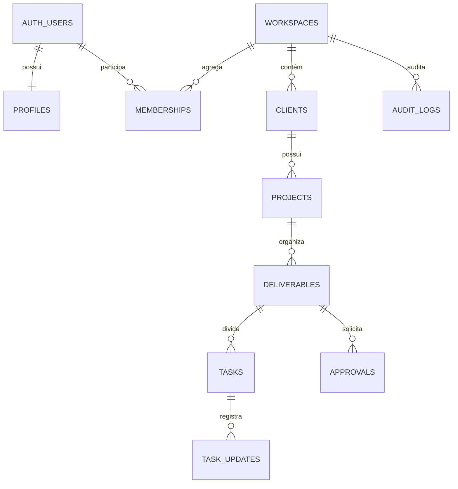

# Banco e autenticação local

## Resultado desta fase

O esquema usa PostgreSQL/Supabase com isolamento por `workspace_id`, RLS em todas as tabelas públicas e uma segunda barreira de autorização na aplicação. O login é passwordless: usuários fictícios já existentes recebem um link mágico no Mailpit local; cadastro público está desativado.



As chaves estrangeiras compostas repetem `workspace_id` na hierarquia. Assim, mesmo uma falha na aplicação não consegue associar um projeto da Agência Aurora a um cliente do Estúdio Horizonte. O `workspaceId` recebido do navegador nunca determina autorização: as políticas consultam `auth.uid()` e `memberships`.

## Ambientes e variáveis

Copie `.env.example` para `.env.local` e substitua apenas a chave pública pela chave mostrada ao iniciar o Supabase. Nunca exponha `service_role`. Desenvolvimento, teste e produção devem usar projetos, URLs e chaves distintos; migrações são a fonte versionada comum.

Se qualquer URL ou chave pública necessária estiver ausente ou inválida, a aplicação lança apenas `AuthConfigurationError`, sem repetir valores sensíveis.

## Execução com Supabase local

Pré-requisito: Docker Desktop, Rancher Desktop, Podman ou outro runtime compatível com Docker.

```text
pnpm db:start
pnpm db:reset
pnpm dev
```

- Aplicação: `http://localhost:3000/login`
- API Supabase: `http://127.0.0.1:54321`
- Mailpit: `http://127.0.0.1:54324`

Contas fictícias disponíveis, sem senha versionada:

- `admin@aurora.workflow.local` — administrador da Agência Aurora
- `member@aurora.workflow.local` — membro da Agência Aurora
- `admin@horizonte.workflow.local` — administrador do Estúdio Horizonte

Digite uma delas no login e abra o link recebido no Mailpit. O callback troca o código por uma sessão HTTP-only; páginas protegidas confirmam o usuário com o servidor do Supabase, e o proxy apenas renova cookies.

## Verificação local e alternativa portátil

O ambiente completo em Docker foi validado em 8 de agosto de 2026: dois resets consecutivos aplicaram migração e seed, e o teste E2E percorreu link mágico no Mailpit, callback PKCE, rota protegida, logout e bloqueio anônimo. O provedor de e-mail permanece ativo para usuários do seed, enquanto o cadastro global e `shouldCreateUser` continuam desativados.

`pnpm db:test` mantém uma alternativa portátil em PGlite, um PostgreSQL real em WebAssembly, com stubs mínimos das roles e de `auth.uid()`. Ela cobre sintaxe PostgreSQL, constraints, seed repetido, RLS anônimo e isolamento cross-tenant, mas não substitui o teste de integração do GoTrue/Mailpit.

## Matriz de autorização

| Recurso                | Anônimo |                                  Membro |                      Administrador |
| ---------------------- | ------: | --------------------------------------: | ---------------------------------: |
| Workspace e hierarquia |  negado |               leitura no próprio tenant |  leitura/escrita no próprio tenant |
| Tarefa atribuída       |  negado | leitura e atualização da própria tarefa |           gestão no próprio tenant |
| Atualização de tarefa  |  negado |            leitura e criação como autor |       leitura e criação como autor |
| Aprovação              |  negado |                                 leitura |           gestão no próprio tenant |
| Auditoria              |  negado |                        evento como ator | leitura e evento no próprio tenant |
| Exclusão física        |  negado |                                  negado |          negado; use `archived_at` |

## Alertas determinísticos do seed

O seed aciona seis regras observáveis: tarefa crítica vencida e bloqueada, entrega próxima com pendências, projeto sem atividade, aprovação pendente, bloqueio futuro e entrega importante saudável. Datas usam `timestamptz`/UTC e são relativas ao instante do seed.

## Comandos de verificação

```text
pnpm db:test
pnpm lint
pnpm typecheck
pnpm test
pnpm test:e2e
pnpm build
git diff --check
```

`supabase/seed.sql` é idempotente e pode ser aplicado duas vezes sem duplicação. `supabase db reset --local` recria o banco integralmente quando o runtime de containers estiver disponível.
